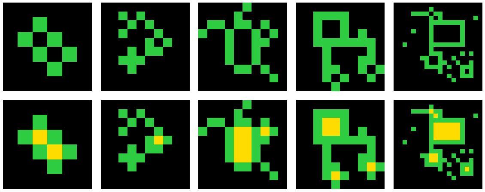

# rStar meets ARC

## Applying Self-play muTuAl Reasoning (rStar) on the Abstraction and Reasoning Corpus (ARC)

## Description
The goal of this project is to apply the rStar-Math algorithm to the ARC dataset. 

## Badges
On some READMEs, you may see small images that convey metadata, such as whether or not all the tests are passing for the project. You can use Shields to add some to your README. Many services also have instructions for adding a badge.

## Visuals
## Example: ARC task 00d62c1b

## Usage
Use examples liberally, and show the expected output if you can. It's helpful to have inline the smallest example of usage that you can demonstrate, while providing links to more sophisticated examples if they are too long to reasonably include in the README.

## Roadmap
If you have ideas for releases in the future, it is a good idea to list them in the README.

## Authors and acknowledgment
Show your appreciation to those who have contributed to the project.

## License
This project is licensed under the MIT License.

## Project status
Knee-deep in development ...