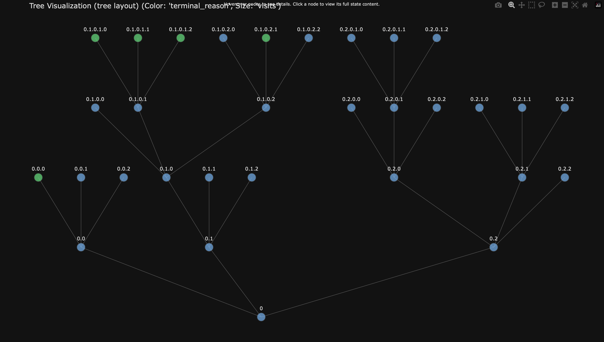

# rSTAR meets ARC
## Weekly progress report

### Week 1 (03.03.2025)

- **Work planned**: 
  - Do some more research on ARC and rSTAR
  - Start coding up a bare-bones working version of "Round 1"
    - Decide how to break down code into classes and functions
    - Defined "step format" in tree
  - 

- **Work done**: 
  - Research
  - Started breaking down code into classes and functions
  - Getting a cold (again) in the first week of the project :(

- **Issues and Questions**:
  - Probably LLM fine-tuning and alignment needed before "Round 1" is feasible
  - Would a reasoning model help with making sense of longer prompts and possibly give answers that have the correct format more often?
  - Discuss "step format" in more detail.
  - 

### Week 2 (10.03.2025)

- **Work planned**: 
  - Finish coding up a bare-bones working version of "Round 1"
  - Clean up code and make it as "extendable" as possible

- **Work done**: 
  - Decided on not specifying the extent of the step format beyond the "python block" limitation (that means the prefix code of every step must be valid python code)
  - Successfully implemented working version of "Round 1" with beam search agent (also successfully solved first ARC Task)
  - Rewriting code to adhere to HCP Storage best practices (i.e. use local scratch space for all intermediate files)
  - Wrote tree visualizer to help with debugging (and because it's cool)
  - 

- **Issues and Questions**:
  - It seems the SLMs have very weak performance with the current system. What is the best way to mitigate this issue?
  - How do I effectively optimize the prompt for the policy SLM?
  - Sometimes the LLMs freeze up if I submit multiple jobs?

- **Visuals**:
  - Tree visualization output: (Beam Search: width=3, branching_factor=3)
    

### Week 3 (17.03.2025)

- **Work planned**:
    - Experiment with different prompts and prompt formats for the policy SLM
    - Test the "best" versions on more ARC tasks and see how they perform
    - Potentially generate more simple ARC tasks to generate to data for supervised fine-tuning of the policy SLM
    - Think about how to effectively use reasoning models in the current system
    - Think about better step definitions that allow for more comprehensive intermediate code execution

- **Work done**: 
  - 

- **Issues and Questions**:
  - 

