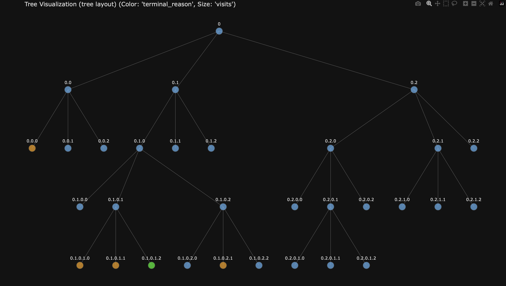
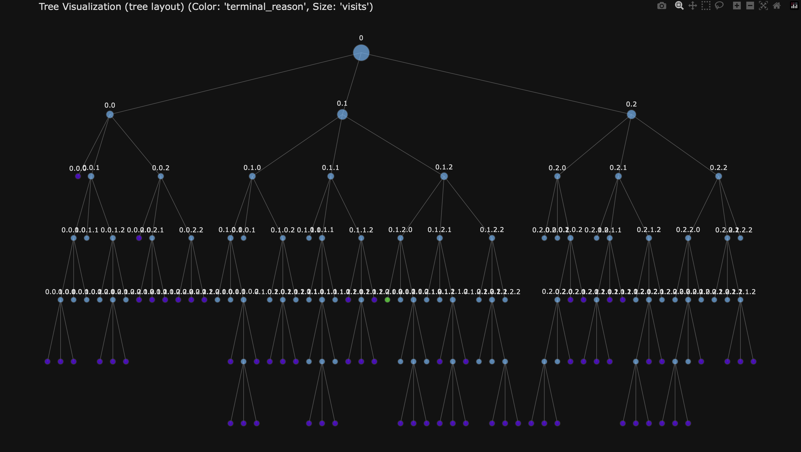

# rSTAR meets ARC

## Weekly progress report

### Week 1 (03.03.2025)

- **Work planned**:
  - Do some more research on ARC and rSTAR
  - Start coding up a bare-bones working version of "Round 1"
    - Decide how to break down code into classes and functions
    - Defined "step format" in tree

- **Work done**:
  - Research
  - Started breaking down code into classes and functions
  - Getting a cold (again) in the first week of the project :(
  - Being plagued by needing to constantly make decisions and trade-offs

- **Issues and Questions**:
  - Probably LLM fine-tuning and alignment needed before "Round 1" is feasible
  - Would a reasoning model help with making sense of longer prompts and possibly give answers that have the correct
    format more often?
  - Discuss "step format" in more detail.

---

### Week 2 (10.03.2025)

- **Work planned**:
  - Finish coding up a bare-bones working version of "Round 1"
  - Clean up code and make it as "extendable" as possible

- **Work done**:
  - Decided on not specifying the extent of the step format beyond the "python block" limitation (that means the
    prefix code of every step must be valid python code)
  - Successfully implemented working version of "Round 1" with beam search agent (also successfully solved first ARC
    Task)
  - Rewriting code to adhere to HCP Storage best practices (i.e. use local scratch space for all intermediate files)
  - Wrote *tree visualizer* to help with debugging (and because it's cool)
  - Played firefighter (fire=bugs) basically for a week straight (I'm not complaining, I love it)
  - Wrote most of the MCTS implementation (should be functional now, but hasn't been thoroughly tested yet)
  - Wrote and rewrote the code execution environment (the second version now uses subprocesses which is more scalable
    and now I have more fine-grained control over resources)
  - **Finished a first rudimentary proof of concept!!!**

- **Issues and Questions**:
  - It seems the SLMs have very weak performance with the current system. What is the best way to mitigate this issue?
  - How do I effectively optimize the prompt for the policy SLM?
  - Sometimes the LLMs freeze up if I submit multiple jobs?
  - The net scratch seems to be overloaded a lot of times ...

- **Visuals**:
  - Tree visualization output for beam search with branching factor 3 and width 3  
    

  - Tree visualization output for mcts 16 rollouts and branching factor 3  
    

---

### Week 3 (17.03.2025)

- **Work planned**:
  - Check for errors and bugs (mainly in MCTS implementation) and fix them
  - Experiment with different prompts and prompt formats for the policy SLM
  - Test the "best" versions on more ARC tasks and see how they perform
  - Curate a set of "very easy" tasks to use as reference when making changes to the system
  - Think about how to use reasoning models in the current system
  - Think about better step definitions that allow for more comprehensive intermediate code execution
    - Also try to do more sophisticated code analysis and intermediate code execution (this should come at virtually
      no runtime cost)
  - **Major code refactoring for maintainability** (I will probably try to take some more inspiration from the
    rStar-Math implementation)
    - use "logging" instead of "print" statements
    - use "cProfile" to profile the code and find bottlenecks
    - update vllm to the latest version and fix bugs that arise from this
    - batch requests to the LLMs to reduce overhead
  - *Do research on fine-tuning LLMs*
  - *Write code for LLM fine-tuning*
  - *Potentially look into using a bigger model for the initial fine-tuning data generation*

- **Work done**:
  - Update prompt to include two more examples of varying difficulty and made choosing the number of examples simpler
  - Switched the whole project from printing to hierarchical logging
  - Updated to the newest version of vllm to enable usage of the newest thinking models (updated all other libraries
    too)

  - Decided on trying to fine tune the initial policy LLM with data generated from a thinking model (QwQ-32B)
  - Started writing code to generate bootstrapping data for the policy LLM

  - Finished with the major code refactoring: (days of planning and work)
    - Complete ground up code rewrite inspired by rStar-Math codebase
    - cleaner code
    - batching requests to the LLM
    - using subprocess without disk IO for code execution

  - added progressive widening MCTS agent (PWMCTS) as a new agent
    - more resilient against initial bad generations
    - essentially widens the search space as it goes along
    - have to think about how to correctly(!) integrate into the puct child selection process

  - Came up with new ideas for initial bootstrapping
    - bootstrapping using self generated solutions:
      - create "multi-rooted tree" where each root has a different example in the prompt
      - create dummy root node connecting all the roots
      - run MCTS on this augmented tree

  - Fine tuning data filtering
    - the LLM tends to either find no solution or a lot of solutions
    - filtering out solutions that are too long compared to the shortest one (consider code only and not comments)
    - get rid of steps that don't contribute to the final solution (get rid of steps that don't change the output)

  - Fine tuning data augmentation
    - use reARC to generate a lot more tasks for solved tasks

- **Issues and Questions**:
  - How do I effectively work with the output of QwQ or other thinking models? (parsing, filtering, etc.)

### Week 4 (24.03.2025)

- **Work planned**:
  - look into adding variable temperature to progressive widening MCTS agent
  - Add percentage-correct based terminal rewarding to the MCTS agent
  - Implement new tree of trees agent!!
  - Number of children based generation!!
  - Work on prompt format fine-tuning
  - implement competition submission logic (i.e. choose two solutions that solve training task, but with different
    results on test tasks (two most often generated)
  - test capabilities of the current system on more ARC tasks
  - test effectiveness of using larger models ("Qwen/Qwen2.5-Coder-32B-Instruct")
  - test a variety of different hyperparameters for the MCTS agent
  -
  - Write the data saving code for the fine-tuning data
  - Write the data filtering and augmentation code for the fine-tuning data

  - potentially continue working on QwQ-32B bootstrapping code (unlikely)

  - ARC-AGI-2 RELEASE !!!
    - Read up on ARC-AGI-2, sign up for the competition, think what changes could be interesting to make to the system
      to make it more competitive
    - Do a submission of Kaggle to get a feel for the competition, the submission process, and the evaluation process
    - Get a score!

- **Work done**:
  - None

- **Issues and Questions**:
  - None

