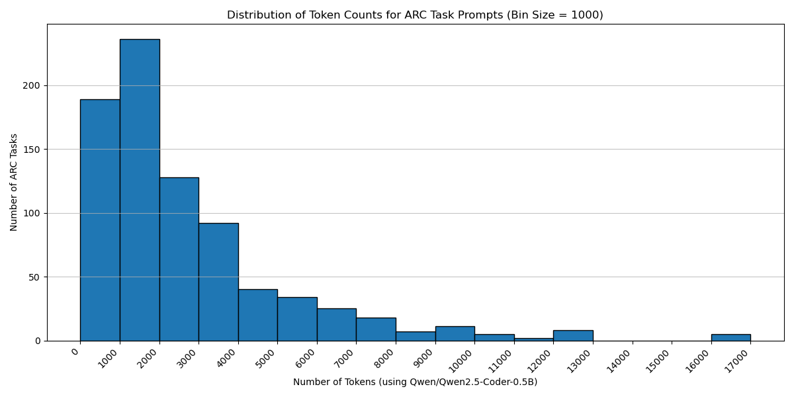
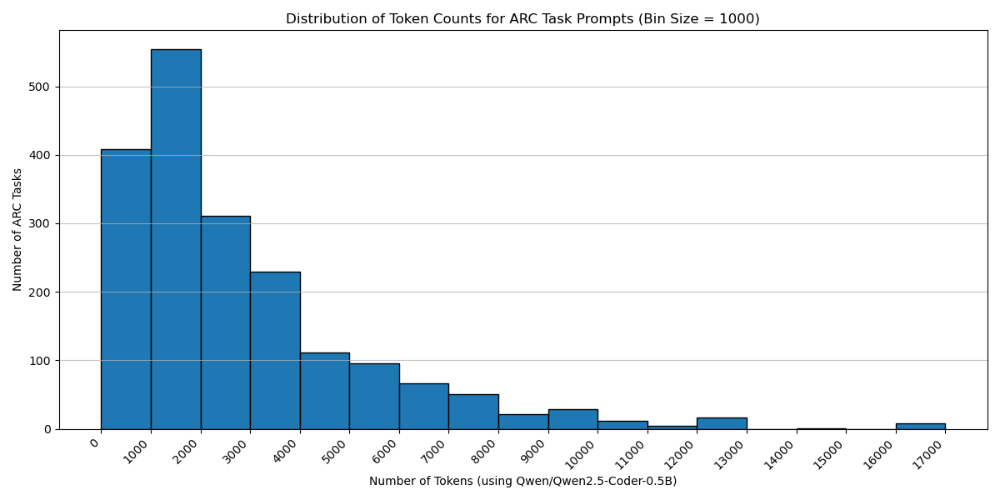

# rSTAR meets ARC

## Weekly progress report

### Week 1 (03.03.2025)

- **Work planned**:
  - Do some more research on ARC and rSTAR
  - Start coding up a bare-bones working version of "Round 1"
    - Decide how to break down code into classes and functions
    - Defined "step format" in tree

- **Work done**:
  - Research
  - Started breaking down code into classes and functions
  - Getting a cold (again) in the first week of the project :(
  - Being plagued by needing to constantly make decisions and trade-offs

- **Issues and Questions**:
  - Probably LLM fine-tuning and alignment needed before "Round 1" is feasible
  - Would a reasoning model help with making sense of longer prompts and possibly give answers that have the correct
    format more often?
  - Discuss "step format" in more detail.

---

### Week 2 (10.03.2025)

- **Work planned**:
  - Finish coding up a bare-bones working version of "Round 1"
  - Clean up code and make it as "extendable" as possible

- **Work done**:
  - Decided on not specifying the extent of the step format beyond the "python block" limitation (that means the
    prefix code of every step must be valid python code)
  - Successfully implemented working version of "Round 1" with beam search agent (also successfully solved first ARC
    Task)
  - Rewriting code to adhere to HCP Storage best practices (i.e. use local scratch space for all intermediate files)
  - Wrote *tree visualizer* to help with debugging (and because it's cool)
  - Played firefighter (fire=bugs) basically for a week straight (I'm not complaining, I love it)
  - Wrote most of the MCTS implementation (should be functional now, but hasn't been thoroughly tested yet)
  - Wrote and rewrote the code execution environment (the second version now uses subprocesses which is more scalable
    and now I have more fine-grained control over resources)
  - **Finished a first rudimentary proof of concept!!!**

- **Issues and Questions**:
  - It seems the SLMs have very weak performance with the current system. What is the best way to mitigate this issue?
  - How do I effectively optimize the prompt for the policy SLM?
  - Sometimes the LLMs freeze up if I submit multiple jobs?
  - The net scratch seems to be overloaded a lot of times ...

- **Visuals**:
  - Tree visualization output for beam search with branching factor 3 and width 3  
    

  - Tree visualization output for mcts 16 rollouts and branching factor 3  
    

---

### Week 3 (17.03.2025)

- **Work planned**:
  - Check for errors and bugs (mainly in MCTS implementation) and fix them
  - Experiment with different prompts and prompt formats for the policy SLM
  - Test the "best" versions on more ARC tasks and see how they perform
  - Curate a set of "very easy" tasks to use as reference when making changes to the system
  - Think about how to use reasoning models in the current system
  - Think about better step definitions that allow for more comprehensive intermediate code execution
    - Also try to do more sophisticated code analysis and intermediate code execution (this should come at virtually
      no runtime cost)
  - **Major code refactoring for maintainability** (I will probably try to take some more inspiration from the
    rStar-Math implementation)
    - use "logging" instead of "print" statements
    - use "cProfile" to profile the code and find bottlenecks
    - update vllm to the latest version and fix bugs that arise from this
    - batch requests to the LLMs to reduce overhead
  - *Do research on fine-tuning LLMs*
  - *Write code for LLM fine-tuning*
  - *Potentially look into using a bigger model for the initial fine-tuning data generation*

- **Work done**:
  - Update prompt to include two more examples of varying difficulty and made choosing the number of examples simpler
  - Switched the whole project from printing to hierarchical logging
  - Updated to the newest version of vllm to enable usage of the newest thinking models (updated all other libraries
    too)

  - Decided on trying to fine tune the initial policy LLM with data generated from a thinking model (QwQ-32B)
  - Started writing code to generate bootstrapping data for the policy LLM

  - Finished with the major code refactoring: (days of planning and work)
    - Complete ground up code rewrite inspired by rStar-Math codebase
    - cleaner code
    - batching requests to the LLM
    - using subprocess without disk IO for code execution

  - added progressive widening MCTS agent (PWMCTS) as a new agent
    - more resilient against initial bad generations
    - essentially widens the search space as it goes along
    - have to think about how to correctly(!) integrate into the puct child selection process

  - Came up with new ideas for initial bootstrapping
    - bootstrapping using self generated solutions:
      - create "multi-rooted tree" where each root has a different example in the prompt
      - create dummy root node connecting all the roots
      - run MCTS on this augmented tree

  - Fine tuning data filtering
    - the LLM tends to either find no solution or a lot of solutions
    - filtering out solutions that are too long compared to the shortest one (consider code only and not comments)
    - get rid of steps that don't contribute to the final solution (get rid of steps that don't change the output)

  - Fine tuning data augmentation
    - use reARC to generate a lot more tasks for solved tasks

- **Issues and Questions**:
  - How do I effectively work with the output of QwQ or other thinking models? (parsing, filtering, etc.)

### Week 4 (24.03.2025)

- **Work planned**:
  - look into adding variable temperature to progressive widening MCTS agent
  - Add percentage-correct based terminal rewarding to the MCTS agent
  - Implement new tree of trees agent!!
  - Number of children based generation!!
  - Work on prompt format fine-tuning
  - implement competition submission logic (i.e. choose two solutions that solve training task, but with different
    results on test tasks (two most often generated)
  - test capabilities of the current system on more ARC tasks
  - test effectiveness of using larger models ("Qwen/Qwen2.5-Coder-32B-Instruct")
  - test a variety of different hyperparameters for the MCTS agent
  -
  - Write the data saving code for the fine-tuning data
  - Write the data filtering and augmentation code for the fine-tuning data

  - potentially continue working on QwQ-32B bootstrapping code (unlikely)

  - ARC-AGI-2 RELEASE !!!
    - Read up on ARC-AGI-2, sign up for the competition, think what changes could be interesting to make to the system
      to make it more competitive
    - Do a submission of Kaggle to get a feel for the competition, the submission process, and the evaluation process
    - Get a score!

  - Came up with the idea of probabilistic node validation
  -

- **Work done**:
  - Added "percentage correct" based terminal rewarding to the MCTS agent (Custom Agent)
  - Started generating SFT data for the policy LLM
    - wrote program to give summary of covered tasks
  - Worked on prompt fine-tuning
  - Tested variety of different hyperparameters
  - Wrote data saving code for the fine-tuning data
  - Wrote data filtering code for the fine-tuning data (gets rid of steps that don't contribute to the final solution)
  - Added variable temperature search: this is a simplified version of the number of children based approach in favor of
    simplicity and efficiency (vllm batching does not allow different temperatures in the same request)
  - Handwrote 10 high quality one shot example tasks for the policy LLM
  - Started work on writing a better system to give examples to the policy LLM

- **Issues and Questions**:
  - Issue with context window size and OOM errors
    - Task grid representations require a lot of tokens
    - Longer one-shot/few-shot examples require more tokens and the model is "encouraged" to generate more tokens per
      step
  - I think my model choice might be suboptimal
    - I will try using the non-instruct version of Qwen/Qwen2.5-Coder
    - Their blog post mentions the non-instruct versions being better for code completion and fine-tuning
  - Fine-tuning and instruction prompts / examples
    - Do I understand correctly that fine-tuning is not done with the typical instruction prompt?
    - Does it make a difference whether I fine tune on whole solutions or all partial solution traces?
  - Fine-tuning: LoRA vs. full model
    - I want the model to gain an understanding of grid, patterns, symmetry, etc.

- **Results**: 
  - "Round 0" solved tasks with 6d0aefbc and 1cf80156 as examples (Qwen/Qwen2.5-Coder-7B-Instruct): 
    - training: 23/400 = 5.75% coverage
    - training_extended: 712/8939 = 7.97% coverage
    - Notable tasks that were solved: id_recolor_oe_6, 4258a5f9, compress_1

### Week 5 (31.03.2025)

- **Work planned**:
  - rollout-index based examples ("rotating examples")
  - variable temperature rollouts
  - enhance quality and quantity of handwritten examples
  - finish designing custom agent for first round
  - Implement sft data metadata saving: 
    - for analysis/thesis writing
    - for choosing the best solutions using Q values (SFT)
    - potentially collecting positive-negative pairs for first version of reward model (PPM)
  - thoroughly test this agent and the methodology and select appropriate hyperparameters
  - Conduct "Round 1" sft data generation by doing a massive number of rollouts on A100s with 14B model and big context window length
  - Assess situation after generation: good enough training set coverage or not??
  - Select and clean SFT data
  - Augment SFT data (including validation to make sure the solution generalizes to all re-ARC examples)
  - Fine-tuning: 
    - select appropriate method
    - write code to do it
    - select reasonable hyperparameters
    - train "cheap" first version
    - do some testing and go from there

- **Work done**:
  - rollout-index based examples ("rotating examples")
  - variable temperature rollouts (lerp and beta CDF)
  - enhanced quality and quantity of handwritten examples (total of 30+ examples, some left out of training)
  - finished designing custom agent for first round (in custom.py))
  - did a lot of testing and SFT-data saving
  - implemented solution metadata saving
  - some slight modifications to the data cleaning code
  - implemented the data augmentation code
  - wrote SFT code and did some minimal testing with 0.5B parameter model
  -

- **Issues and Questions**:
  - 

- **Results**: 
  - Round number: 0 (with more handwritten examples and more compute and larger models (14B and 32B))
    - training: 73/400 = 18.25% coverage
    - training_extended: 1180/8939 = 13.20% coverage
    - Total unique tasks: 1253

### Week 6 (07.04.2025)

- **Work planned**:
  - generating training data using human descriptions of ARC tasks
  - work on cleaning and augmentation code
  - do research on fine-tuning
  - work in fine-tuning an initial policy model

- **Work done**:
  - compiled human descriptions for both the training and test set (HARC and LARC datasets)
    - these descriptions will only be used for the bootstrapping phase
    - most of this code is untracked, as it was written quick and dirty to achieve the goal as quickly as possible
  - "translated and augmented" these human descriptions into a better format: 
    - the human descriptions contain colors and the model gets values
    - there are a multiple human descriptions (some more detailed/accurate and others incomplete/wrong)
    - I gave the human descriptions along with the "color translation" to:
      - Gemini 2.0 Flash: told it to translate and piece together the descriptions
      - o3-mini: told it to translate, curate and verify the descriptions and then come up with correct instructions mean for a programmer with the goal of coding the transformation function
      - o3-mini descriptions unsurprisingly performed way better, but also, I had to use up about 100 million o3-mini tokens ...
      - Don't worry, I didn't spend 400+$ on API credits. I did it for free. Don't ask how.
  - wrote code for preference pair sft data saving
  - created custom "Bootstrap" agent that uses the human descriptions to generate training data and validation data
    - I later modified this agent to have hint and no-hint rollouts to efficiently generate preference pair data (first few rollouts are hint rollouts, then probabilistic and in the end no-hint rollouts)
  - worked on augmentation code: 
    - added weight calculation to account for uneven augmentation of tasks (some tasks have don't generalize well to the re-ARC tasks)
    - "best" solutions are selected as follows: 
      - the 64 best average q value solution are chose
      - out of those the 32 shortest solutions are chosen
      - out of those the 8 most diverse solutions are chosen (greedily using non-comment diff)
        - this is done to increase the chance of one of the solutions solving the re-arc tasks
        - re-ARC tasks are them tested against the 8 "best" solutions (in random order) and assigned to the first solution that solves them
    

  - collected (imo) enough training data to start an initial round of policy fine-tuning
  - About 100MB of data (+- 13000 task-solution pairs using re-arc data)
  - worked a lot (too much, it was very frustrating) on the fine-tuning code
    - it took me a while to figure out that "unused columns" were automatically being deleted and sadly my weight column was one of them  
    - custom data collator and custom trainer for weighted data
    - played around with different hyperparameters and tested feasibility on A6000
  - wrote code to fuse and save a fine-tuned model
  - modified tree search code to be able to use fine-tuned models (I.e. use SFT prompt, different loading etc.)
  - did one initial test of an early 0.5B checkpoint (merged) and tried tree search
    - it worked, but likely, due to small model size and little training, performance was underwhelming (1 out of 10 very easy tasks solved and limited format following)
    - started training 1.5B model (one with 8192 context length and one with 10240 context length)

- **Issues and Questions**:
  - How to choose fine-tuning hyperparameters
    - gradient accumulation steps
    - learning rate
    - lora rank, alpha and dropout
  - I tried installing flash attention 2, but it didn't work
    - I even reinstalled my conda env (twice!!) etc. (I was close to teaching my laptop how to fly ...)
    - I gave up.
  - I also was in a vicious fight with the huggingface and pip caching systems
    - they called in help from the quota-guard
    - eventually, I came out on top once I had redirected all the cache directories to the net scratch space

- **Results**: 
  - Round number: 1
    - training: 226/400 = 56.50% coverage
    - evaluation: 10/400 = 2.50% coverage

### Week 7 & 8 (14.04.2025)

- **Work planned**:
  - refactor code (again) to make it more manageable
  - create token count histogram to get a better estimate of context length requirements
  - Continue working on fine-tuning
    - experiment more with hyperparameters, different models, different methods
      - find out what works best i.e. compare eval losses and performance on ARC tasks
    - read thoroughly through Guillermo Barbadillo's Omni-ARC blog posts (possibly the best documented ARC solution journey on the internet)
      - https://ironbar.github.io/arc24/05_Solution_Summary/#abstraction-and-reasoning-challenge
      - https://ironbar.github.io/arc24/modeling/
  - Add all the non-official tasks that are already solved to the training data
  - solve some more evaluation tasks to have a better validation set
    - this is most definitely easier said than done and I will likely not be able to do this easily, because o3-mini generated descriptions seem not to help much (see week 6 results)
  - write reward model code
    - validate and potentially fix the preference pair saving code
    - write code to efficiently work with preference pairs (for augmentation etc.)
    - the reward model itself (value head etc.)
    - the code to integrate it correctly into the existing deepthink (tree search) system
    - the code for dataset generation (and possible augmentation)
    - the code for training the reward model
  - try collecting enough preference pair data to train a reward model
  - potentially train a very small first version of the reward model to test the code and the integration and 
    see if it works

- **Work done**:
  - token count histogram created (counts only token for task representation)
  - some code refactoring, mainly related to the data pipeline and training code
  - read Guillermo Barbadillo's Omni-ARC blog posts
  - Added all the non-official tasks that are already solved to the training data (adapted all the other code to handle it appropriately)
  - wrote first (not fully tested) version of the reward model code
    - reworked some of the preference-pair saving logic and added logic to save solutions in the "chosen subtree" for augmentation
    - wrote code to augment the preference pairs
    - wrote a correct version of the reward model that works well with all other parts of the code
    - wrote code for reward model dataset generation
    - wrote code for training the reward model (works)

- **Issues and Questions**:
  - I noticed I did not have all the data necessary to augment the preference pair data

- **Results**:
  - ??

- **Visuals**:
  - here are 2 histograms of task representation token counts:
    - ARC-AGI-1 tasks

    - ARC-AGI-1 and ARC-AGI-2 tasks

### Week 9 (28.04.2025)

- **Work planned**:
  - generate new descriptions with newer models
  - add better way to start batch jobs
  - get a fine-tuned version actually working and use it to solve tasks
  - get familiar with how to use the CSCS cluster

- **Work done**:
  - generated new descriptions
  - added better way to start slurm jobs
  - got the fine tuned version basically working (still some kinks to work out with the scoring vram consumption)

- **Issues and Questions**:
  - ??

- **Results**:
  - ??

- **Visuals**:
  - 

### Week 10 & 11 (05.05.2025)

- **Work planned**:
  - try out CSCS
  - mask out prompt and task for loss calculation
  - loss origin
  - scale down training data
  - integrate full solution generation and testing into training pipeline
  - qualitatively analyze outputs of fine-tuned models

- **Work done**:
  - added completion-only logic to policy model training (reward model unaffected because it works very differently)
  - started using CSCS Daint and wrote bash script to make Daint look like tik (file system wise)
  - integrated full solution generation into training pipeline to qualitatively evaluate the policy model
  - 

- **Issues and Questions**:
  - ??

- **Results**:
  - ??

- **Visuals**:
  - 

